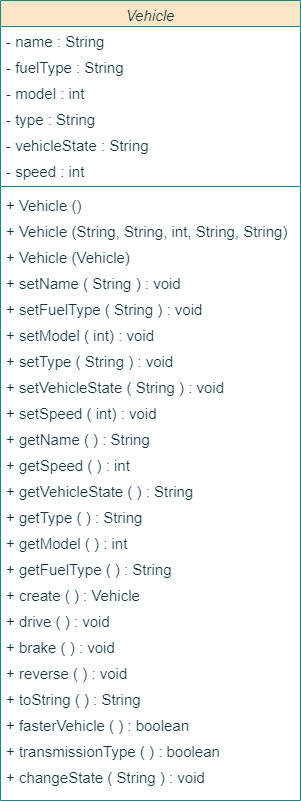

# Vehicle State Management System

This repository contains a Java-based Object-Oriented Programming (OOP) project that simulates vehicle behavior. The project emphasizes **encapsulation**, **state management**, and basic UML implementation. 

It was designed to encapsulate the properties and behaviors of different vehicles, supporting various operations like driving, braking, reversing, and parking while ensuring appropriate state transitions.

## 📌 Features

* **Encapsulation**: Private attributes with public accessor (getters) and mutator (setters) methods.
* **State Management**: Vehicles transition between distinct states: `Driving` (D), `Reverse` (R), and `Parking` (P). Actions like accelerating or braking are restricted based on the current state.
* **Deep Copying**: Implements a copy constructor and a `create()` method to safely duplicate vehicle instances without reference sharing.
* **Speed Control**: 
    * `drive()`: Accelerates the vehicle by 10 km/h (only if in the Driving state).
    * `brake()`: Decelerates the vehicle by 100 km/h (minimum speed is capped at 0 km/h).
* **Object Comparison**: Methods to compare the speed (`fasterVehicle()`) and transmission type (`transmissionType()`) between two different vehicle instances.

## 🏗️ Class Structure

### `Vehicle.java`
The core class that defines the blueprint for vehicle objects. 
* **Attributes**: `name`, `fuelType`, `model`, `type` (transmission), `vehicleState`, and `speed`.
* **Key Methods**: `drive()`, `brake()`, `reverse()`, `changeState()`, `create()`, and `toString()`.

### `Main.java`
The driver class that tests the implementation:
1.  Instantiates three `Vehicle` objects with initial attributes and 0 km/h speeds.
2.  Manipulates states and simulates driving/braking sequences for each vehicle.
3.  Demonstrates object comparisons (transmission and speed).
4.  Displays properties using both the `toString()` method and individual getter methods.
5.  Tests edge cases, such as trying to drive while in the "Reverse" state.

## 📊 UML Diagram

*(Make sure to upload the `UML.png` file to your repository in the same folder as this README, or update the image path below)*



## 🚀 How to Run

1.  **Clone the repository**:
    ```bash
    git clone [https://github.com/yourusername/your-repo-name.git](https://github.com/yourusername/your-repo-name.git)
    cd your-repo-name
    ```
2.  **Compile the Java files**:
    ```bash
    javac Main.java Vehicle.java
    ```
3.  **Run the application**:
    ```bash
    java Main
    ```

## 💻 Example Output
The console will display the initial details of the vehicles, followed by a log of state changes, acceleration increments, braking decrements, and comparisons:

```text
/////////////////////Vehicle 1///////////////////
Vehicle Details: 
Name: Toyota
Fuel Type: Petrol
...
Vehicle state changed to Driving
Accelerating. Current speed: 10 km/h
...
Applying brakes. Current speed: 0 km/h
Transmission is not same for both vehicle.
...
